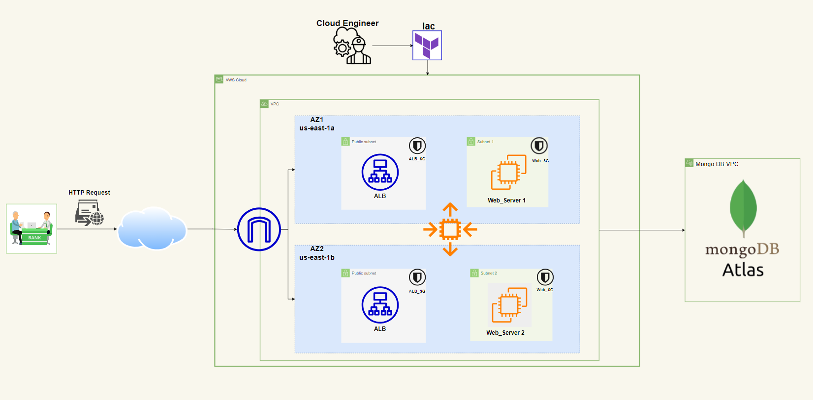

# 🚀 Deploying a Dynamic Web Application on AWS with Terraform

This repository contains a complete infrastructure and deployment setup for a modern web application using **Terraform** and **AWS EC2**, with a separation between the **Angular frontend** and **Node.js (TypeScript) backend**.

---

## 📘 Quick Start – Deployment Guide

📄 For full deployment steps, configuration, and usage instructions, please refer to the [`DEPLOY.md`](./DEPLOY.md) file.

---

## 📦 Tech Stack

| Layer        | Technology                                    |
|--------------|----------------------------------------------|
| 🌐 Frontend  | Angular, hosted on EC2 + NGINX                |
| 🧰 Backend   | Node.js (TypeScript), REST API                |
| ☁️ Cloud     | AWS EC2, VPC, ALB, Auto Scaling, S3           |
| ⚙️ IaC       | Terraform for full infrastructure automation |
| 🔐 Security  | Custom Security Groups + Public/Private Subnets |
| 🧠 Database  | MongoDB Atlas (Managed NoSQL)                 |

---

## 🧱 Infrastructure Overview

- VPC with public & private subnets across multiple Availability Zones
- Application Load Balancer (ALB) with target groups
- Auto Scaling Group for backend EC2 instances
- EC2 instance hosting Angular frontend with NGINX
- MongoDB Atlas integration with backend
- Terraform modules to automate all infrastructure provisioning and deployment

---

## 📁 Project Structure

├── Compute/
│   ├── VPC.tf
│   ├── ALB.tf
│   └── ...
├── DEPLOY.md
├── README.md
└── architecture.png

---

## 🔐 Security Considerations

- ✅ Public access limited to port 80 (HTTP) only
- ✅ Backend instances are NOT publicly exposed; traffic routes through reverse proxy (NGINX + ALB)
- ✅ EC2 instances deployed inside private subnets behind ALB
- ✅ Secrets and environment variables are securely managed and never hardcoded
- ✅ Terraform enforces consistent infrastructure and prevents configuration drift
- ✅ Security Groups are tightly scoped and reusable for better maintainability

---

## 🌍 Access

- **Frontend:** Access your Angular app at `http://<your-ec2-public-ip>`
- **Backend API:** Access backend endpoints via `/api/...` routes, proxied through NGINX on the frontend EC2
- **MongoDB Atlas:** Cloud-hosted NoSQL database, securely integrated with backend

---

## 🎓 Project Highlights

- Real-world AWS deployment architecture
- Infrastructure as Code with Terraform for automation and repeatability
- Implements cloud best practices: security, high availability, modularity
- Reverse proxy setup with NGINX for frontend-backend separation
- Clear separation of concerns between frontend and backend
- Easily extensible and replicable architecture

---

## 👨‍💻 About the Author
Cloud Enthusiast ☁
[Eslam Almetwaly](https://github.com/eslamalmetwaly)

---

Thank you for checking out this project!  
Feel free to open issues or contribute via pull requests.

---

## 💬 Feedback & Contributions
Open an issue or pull request if you want to contribute or suggest improvements 🙌

⭐ Star This Repo
If you found this useful, please consider starring the repo to support the work!

